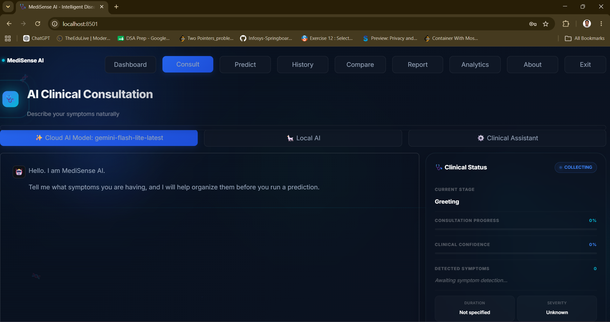
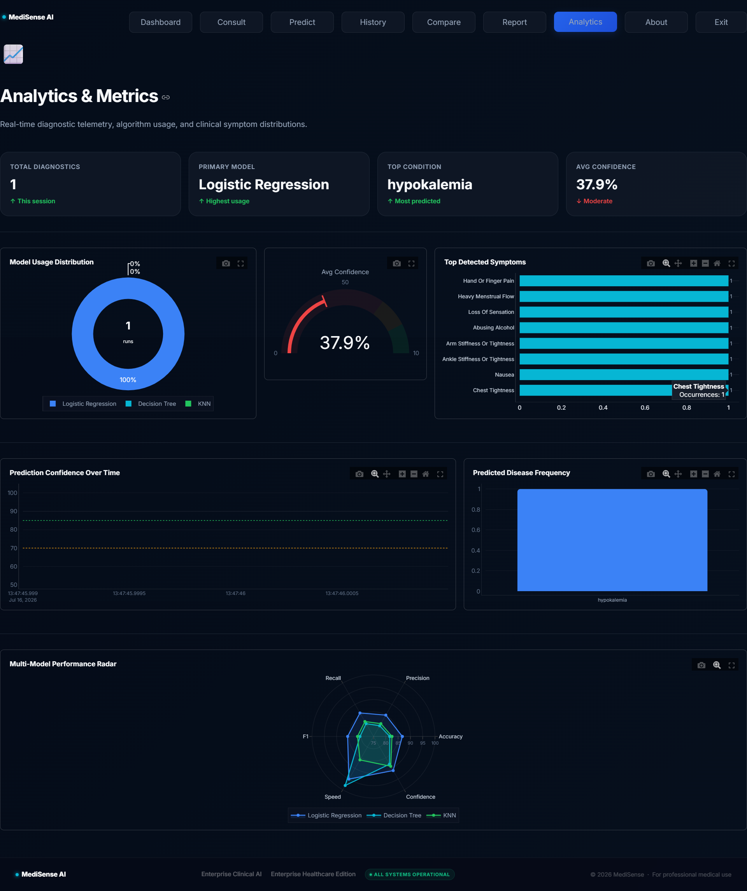

# MediSense AI (Disease Prediction Assistant) 🩺

**MediSense AI** is a premium SaaS-style machine learning platform that predicts possible diseases based on user-provided symptoms. It analyzes user symptoms through a dynamic, conversational interface and leverages advanced machine learning models to predict potential diseases with explainable AI (XAI) insights.

> **⚠️ Medical Disclaimer:** This application provides machine learning-based predictions for educational purposes only. It is not a substitute for professional medical diagnosis or treatment. Always consult a qualified healthcare professional.

---

## 🌟 Key Features

- **Natural Language Symptom Detection:** Start a conversation with the AI. It uses a synonym-mapping engine to understand common phrases (like "stomach ache") and maps them to medical dataset features.
- **Dynamic Consultation:** The AI chatbot actively monitors detected symptoms and asks intelligent, context-aware follow-up questions.
- **Multi-Model Machine Learning:** Choose between Logistic Regression, Decision Trees, and K-Nearest Neighbors (KNN).
- **Explainable AI (XAI):** See exactly *why* the AI made a prediction, how many symptoms matched the dataset profile, and what the confidence score is.
- **Visual Risk Assessment:** Predictions include a visual severity meter and body system categorizations (e.g., Respiratory, Cardiovascular).
- **Live Analytics & History:** Tracks session metrics including most predicted diseases, model usage counts, and a complete chronological history of your predictions.
- **Hidden Developer Dashboard:** Monitor dataset size, scikit-learn versions, model accuracy metrics, and system environments.

---

## 🏗️ Architecture

The project is strictly separated into a modular frontend (Streamlit) and a static machine learning backend. The ML models are pre-trained and serialized, ensuring lightning-fast inference without retraining overhead.

```text
HealthAI/
├── app/                      # Streamlit Frontend Architecture
│   ├── components/           # Reusable UI components (Sidebar, Footer, Navbar)
│   ├── pages/                # Streamlit Multi-Page App routes (Dashboard, Consultation, Admin, etc.)
│   ├── styles/               # Custom CSS for Premium Glassmorphism UI
│   ├── utils/                # Helper functions and session state logic
│   └── main.py               # Application entry point and router
├── data/                     # Raw and processed datasets
├── models/                   # Serialized ML models (.pkl)
├── reports/                  # Model training accuracy reports
├── src/                      # Backend Logic
│   ├── chatbot/              # AI Engine & NLP Layer
│   │   ├── chatbot_router.py # Single public entry point for all AI calls
│   │   ├── gemini_engine.py  # Gemini API adapter
│   │   ├── ollama_engine.py  # Ollama (Qwen) adapter
│   │   ├── basic_engine.py   # Rule-based fallback engine
│   │   ├── conversation_manager.py # Triage-style clinical conversation flow 
│   │   ├── clinical_reasoning.py   # Reasoning logic for predictions
│   │   ├── pipeline.py       # Clinical NLP pipeline
│   │   ├── symptom_normalizer.py
│   │   ├── synonym_index.py
│   │   ├── medical_dictionary.py
│   │   └── memory.py         # Streamlit session state memory
│   ├── prediction/           # Inference and symptom extraction
│   ├── preprocessing/        # Data cleaning pipelines
│   ├── recommendation/       # Logic for mapping diseases to advice
│   └── training/             # Model training scripts
└── README.md
```

---

## 🤖 AI Engine Architecture (Sprint 1)

MediSense AI supports **three consultation modes** with automatic engine
selection and graceful failover. The frontend always calls a single function
(`ask_llm`) and never needs to know which engine is active.

### Engine Priority

```
1️⃣  Gemini API  (preferred — cloud, high quality)
        ↓  (if unavailable)
2️⃣  Ollama / Qwen  (local — privacy-first)
        ↓  (if unavailable)
3️⃣  Basic Rule-Based Engine  (always available)
```

## 🧠 Clinical NLP Pipeline (Sprint 2)

A robust, production-grade Clinical NLP Pipeline converts natural human language into canonical symptom names used by the ML models.
- Uses `symptom_normalizer.py` and `medical_dictionary.py` to map conversational input (e.g., "my tummy hurts") to dataset features ("stomach_pain").
- Extends the core system to support negated symptoms ("I don't have a fever") and severity scoring.

## 🩺 Clinical Conversation Manager (Sprint 3)

The AI mimics a doctor taking history by dynamically triaging the conversation.
- Gathers clinical information over multiple turns rather than predicting immediately.
- Leverages the NLP Pipeline to identify known symptoms and requests follow-ups for ambiguity.
- Tracks severity, duration, and body system to build a comprehensive patient profile before making a prediction.

## 💎 Premium UI/UX & Admin Portal (Sprint 4)

MediSense AI is fully transformed into a premium, SaaS-grade application.
- Uses a consistent design language (Dark Premium, Glassmorphism, Rounded cards).
- Introduces a comprehensive **Admin Dashboard** (`/admin.py`) for system telemetry and KPI monitoring.
- Seamlessly integrates with the AI engine state to present a beautiful clinical panel without exposing backend mechanics.

### How Engine Selection Works

```
Application Start
      │
      ▼
 engine_detector.detect()
      │
      ├─ DEFAULT_ENGINE env var set to a specific engine?
      │       └─ YES → use that engine directly
      │
      └─ AUTO mode:
              ├─ GEMINI_API_KEY present AND connectivity probe passes?
              │       └─ YES → use Gemini ✅
              ├─ Ollama server reachable AND model present?
              │       └─ YES → use Ollama ✅
              └─ Always → use Basic ✅
```

The detected engine is cached in `st.session_state["ai_engine"]` for the duration of the session.

### How Failover Works

```
chatbot_router.ask_llm(messages)
      │
      ├─ Try active engine
      │       └─ Success → return response ✅
      │
      ├─ Engine raises exception or returns Error:
      │       └─ Log warning
      │       └─ Switch to next engine in chain
      │       └─ Retry
      │
      └─ All engines exhausted → return safe fallback message
```

### Configuration

Copy `.env.example` to `.env` and set your values:

```env
# Gemini
GEMINI_API_KEY=your_key_here
GEMINI_MODEL=gemini-2.0-flash

# Ollama
OLLAMA_HOST=http://localhost:11434
OLLAMA_MODEL=qwen2.5:3b
OLLAMA_TIMEOUT=60

# Engine selection: auto | gemini | ollama | basic
DEFAULT_ENGINE=auto
```

### Status Helpers

```python
from src.chatbot.chatbot_router import (
    get_active_engine,   # → "gemini" | "ollama" | "basic"
    is_gemini,           # → bool
    is_ollama,           # → bool
    is_basic,            # → bool
)
```

---

## 🚀 Machine Learning Workflow

1. **Data Acquisition:** Models were trained on an augmented dataset of 377 symptoms mapping to various diseases.
2. **Training:** `train_models.py` handles the extraction, splitting, and scaling of features.
3. **Modeling:** 
   - **Logistic Regression (Recommended):** Best overall accuracy and probability calibration.
   - **Decision Tree:** Excellent for high-variance symptom clusters.
   - **KNN:** Strong distance-based matching.
4. **Serialization:** Models and label encoders are saved using `joblib` into the `models/` directory.

---

## 💻 Tech Stack

- **Frontend:** Streamlit, HTML5, CSS3 (Custom Glassmorphism)
- **Backend:** Python 3.12
- **Machine Learning:** Scikit-Learn, Pandas, NumPy, Joblib
- **Data Visualization:** Streamlit Native Charts

---

## 📦 Large Model Files

Because GitHub has a strict 100 MB file size limit, the larger pretrained machine learning models cannot be hosted directly in this repository. 

To use the Decision Tree and KNN models, you must download them manually:
1. Download `DecisionTree.pkl` and `KNN.pkl` from: [Google Drive Link]
2. Place both files into the `models/general/` directory.
3. Once placed, verify the installation by running the app and checking the Developer Dashboard. The Logistic Regression model is included by default and will work immediately.

---

## ⚙️ Installation & Usage

1. **Clone the repository:**
   ```bash
   git clone https://github.com/yourusername/HealthAI.git
   cd HealthAI
   ```

2. **Create a virtual environment:**
   ```bash
   python -m venv venv
   source venv/bin/activate  # On Windows use: venv\Scripts\activate
   ```

3. **Install dependencies:**
   ```bash
   pip install -r requirements.txt
   ```

4. **Run the Application:**
   ```bash
   streamlit run app/main.py
   ```


## 📸 Screenshots

<p align="center">
  
  
</p>

<p align="center">
  
  
</p>


## 🔮 Future Scope

- Integration with real-time wearable data (Apple HealthKit / Google Fit API).
- Expanding the synonym mapping dictionary using advanced NLP models like BERT.
- Implementing user authentication and persistent database storage (PostgreSQL).

---

## 📄 License

This project is licensed under the MIT License. See the `LICENSE` file for more details.
